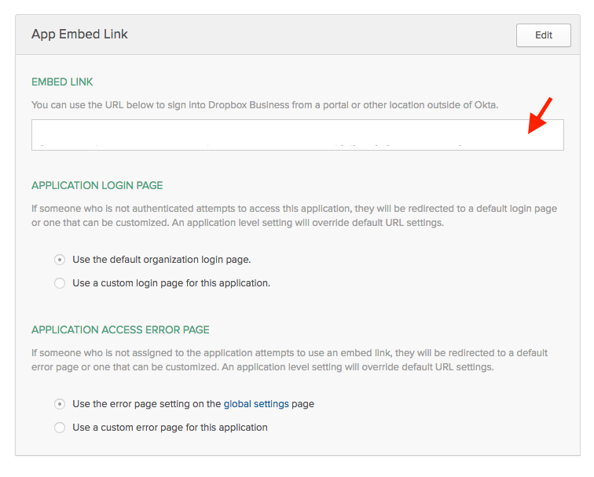

# Simple integration of okta sign in widget
Main guide by Okta [here](https://developer.okta.com/code/javascript/okta_sign-in_widget)

## Create a page for the users to login
### Utilize the boilerplate code (This example uses PhP)

```php
// login.php
<head> 	<!--?php include('.head.php') ?-->
	<meta content="noindex, nofollow" name="robots">
	<!-- Core widget js and css -->
	<script src="https://ok1static.oktacdn.com/assets/js/sdk/okta-signin-widget/1.7.0/js/okta-sign-in.min.js" type="text/javascript"></script>
	<link href="https://ok1static.oktacdn.com/assets/js/sdk/okta-signin-widget/1.7.0/css/okta-sign-in.min.css" type="text/css" rel="stylesheet">
	<!-- Customizable css theme options. Link your own customized copy of this file or override styles in-line -->
	<link href="https://ok1static.oktacdn.com/assets/js/sdk/okta-signin-widget/1.7.0/css/okta-theme.css" type="text/css" rel="stylesheet">

  </head>
  <body>
    <div id="okta-login-container"></div>
      <!-- Script to init the widget -->
    <script>
      // organization url
      var orgUrl = 'https://<okta-subdomain>.<okta-domain>.com';

      // url that the user will be taken to after they successfully login through okta
      var redirectUrl = 'http://<?php echo $current_url; ?>/<re-redirect-page>';

      var oktaSignIn = new OktaSignIn({baseUrl: orgUrl});

      oktaSignIn.renderEl(
        { el: '#okta-login-container' },
        function (res) {
          if (res.status === 'SUCCESS') { res.session.setCookieAndRedirect(redirectUrl); }
        }
      );
    </script>
</body>
```
### Swap out the boilerplate code in the script with correct info, specifically these two variables
```js
// organization url
var orgUrl = 'https://<okta-subdomain>.<okta-domain>.com';

// url that the user will be taken to after they successfully login through okta
var redirectUrl = 'http://<?php echo $current_url; ?>/<re-redirect-page>';
```
## Create a page for the re-direct
### Create links for the items
```php
//login-apps.php
<ul>
  <li>
    <a href="<embed-link>">Link</a>
  </li>
</ul>
```
## Grab all the embed links from the Okta Admin
### From Okta landing page, go to Admin Page

### Use the applications drop-down

### Click on Application chiclets

### Grab embed code


## Voila! Finito.